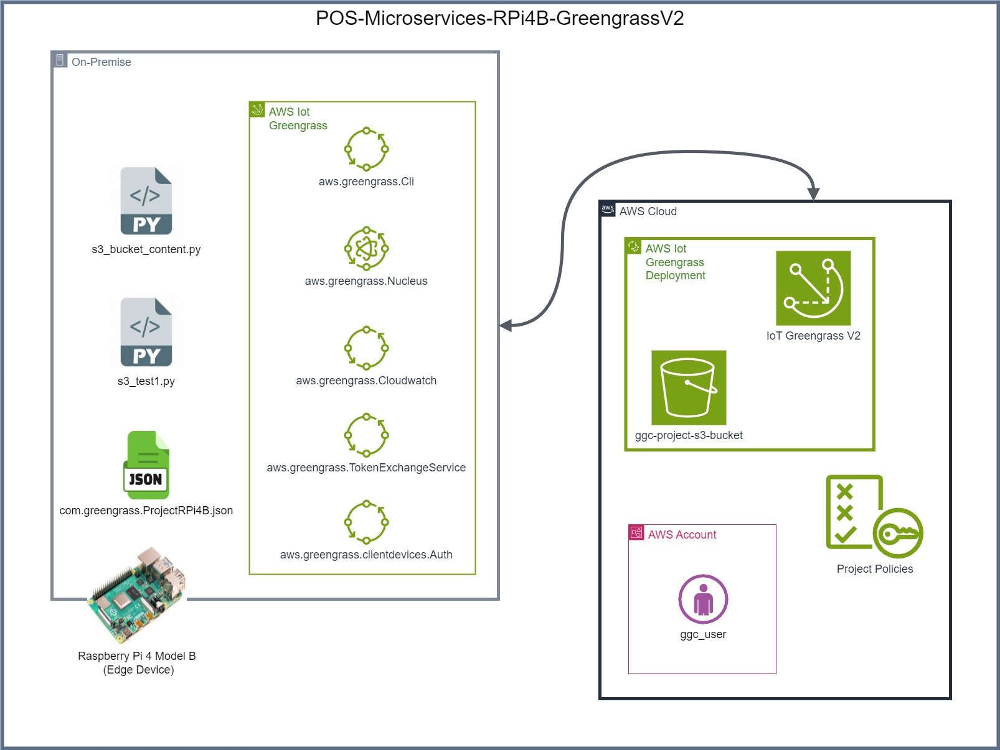

# Seamless Point of Sale Operations: Deploying Cloud-Native Microservices on Raspberry Pi 4B with AWS Greengrass V2

### Ensuring Seamless Data Flow Between Raspberry Pi 4B and AWS Greengrass V2

---

## Project Description
This project focuses on deploying a cloud-native microservices architecture on a Raspberry Pi 4B (RPi4B) using AWS Greengrass V2 to enhance the operational efficiency of point-of-sale (POS) systems. By leveraging AWS Greengrass V2, the project enables offline capabilities for POS devices, allowing them to function seamlessly even during network outages. This deployment reduces latency and ensures a reliable local processing environment, supporting uninterrupted customer service.

The architecture incorporates secure local data processing, with all transactions recorded locally and synchronized to the cloud upon reconnection. This setup optimizes performance during connectivity disruptions and enhances the system's reliability. Key features include:

- **Local Microservices Deployment:** AWS Greengrass V2 runs essential services directly on the Raspberry Pi 4B, minimizing reliance on constant cloud connectivity.
- **Offline Functionality:** POS devices continue operating during network failures, ensuring an improved user experience.
- **Data Synchronization:** Automatic synchronization of locally processed data to AWS once connectivity is restored, maintaining data integrity and continuity.
- **Enhanced Security:** To protect sensitive transaction data, robust security measures, including encryption and access controls, have been implemented.

This project addresses critical challenges in current POS systems, such as performance slowdowns during outages, by providing a scalable, reliable solution that meets the growing demands of modern retail environments.

---

## Table of Contents 
- [Architecture Overview](#architecture-overview)
- [Built With](#built-with)
  - [Hardware](#hardware)
  - [Software](#software)
  - [Applications and Libraries](#applications-and-libraries)
- [Requirements](#requirements)
- [Security Considerations](#security-considerations)
- [Setup Instructions](SETUP.md)
- [Usage Instructions](USAGE.md)
- [Component Built, Test, Deployment, and Troubleshooting](DEPLOYMENT.md)
- [Clean Up](CLEAN_UP.md)
- [Future Enhancements](#future-enhancements)
- [Support Information](#support-information)  
- [License Information](#license-information)
- [Additional Resources](#Additional-Resources)
---

## Architecture Overview

This project leverages AWS Greengrass V2 to deploy a cloud-native microservices architecture on a Raspberry Pi 4B, enabling seamless offline operations for POS devices. The architecture consists of the following key components:

1. **Raspberry Pi 4B:** Acts as the local processing hub, running AWS Greengrass and hosting microservices that enable POS operations even during network outages.
2. **AWS Greengrass V2:** Facilitates the deployment of microservices locally on the Raspberry Pi, ensuring that data processing can occur independently of cloud connectivity. It also manages secure communication between local devices and the cloud.
3. **Local Microservices:** These services, including the `s3_test1.py` script, handle POS transactions, update the `test.csv` file with transaction data, and synchronize with the cloud once internet connectivity is restored.
4. **Data Synchronization:** When the Raspberry Pi regains internet access, it automatically uploads locally stored data to a specified S3 bucket, ensuring all transactions are recorded for further analysis or reporting.
5. **Cloud Integration:** Although only partially utilized at this stage, the architecture is designed to easily integrate with AWS services (like DynamoDB) for future data storage and analytics capabilities.

This architecture enables improved reliability, reduced latency, and secure local processing, providing a robust solution for POS operations in environments with unstable internet connectivity.

---

## Built With

### Hardware
- **Model:** Raspberry Pi 4 Model B Rev 1.2
- **BCM:** BCM2835
- **Architecture:** aarch64
- **OS:** Debian GNU/Linux 11 (bullseye)

### Software
- **AWS Services:**
  - **AWS IoT Greengrass V2:**
    - Greengrass CLI Version: 2.13.0
    - Greengrass Nucleus Version: 2.13.0
    - Greengrass Client Devices Authentication Version: 2.5.1
  - **Amazon S3**
  - **AWS Identity and Access Management (IAM)**

### Applications and Libraries
- **Boto3 (ver. 1.35.46):** AWS SDK for Python, used for interacting with AWS services.
- **CSV Module:** Python’s built-in module for handling CSV file operations.
- **OS Module:** Standard library for interacting with the operating system.
- **Socket Module:** Standard library for networking interfaces.
- **Time Module:** Standard library for time-related functions.
- **Python 3 (ver. 3.9.2):** Version used for scripting.

---

## Requirements
1. An AWS account.
2. Basic knowledge of AWS services navigation.
3. Familiarity with Linux, macOS, or Windows command line, PowerShell, Notepad++, Visual Studio Code, RealVNC Viewer, and WinSCP.
4. Ability to troubleshoot configuration issues.
5. Persistence and patience.

---

## Security Considerations
Keep the following security considerations in mind when recreating this project:
1. Apply best practices and exercise caution while working on this project.
2. Follow **Cybersecurity Best Practices** (CISA).
3. Adhere to **AWS Security Best Practices** to secure AWS resources.
4. Protect your root user credentials.

---

## Setup Instructions
Please have a look at [SETUP.md](SETUP.md) for step-by-step instructions on setting up the project.

---

## Usage Instructions
Please have a look at [USAGE.md](USAGE.md) for instructions on configuring user roles, policies, and AWS Greengrass V2 permissions. This document also includes scripts, tips, and troubleshooting information.

---

## Component Built, Test, Deployment, and Troubleshooting
Please have a look at [DEPLOYMENT.md](DEPLOYMENT.md) for details on building, testing, deploying, and troubleshooting the project components.

---

## Clean Up
Please see [CLEAN_UP.md](CLEAN_UP.md) for step-by-step instructions on removing the project from AWS and the Raspberry Pi 4B.

---

## Future Enhancements
The next version of this project will utilize AWS DynamoDB instead of Amazon S3 to save CSV file updates and integrate two additional Raspberry Pi 4B devices into the AWS Greengrass Core.

---

## Support Information
Please look at the [Support Information](SUPPORT.md) for additional support information.

---

## License Information
This project is licensed under [License Information](LICENSE).

---

### Additional Resources
- [Scripts Folder](Scripts)
- [Pictures Folder](Pictures)
